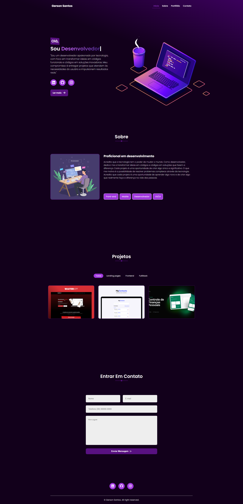

# Landing Page - Portifolio

📌 **Sobre o Projeto**

Esta landing page foi criada para meu portifolio pessoal

🔑 **Funcionalidades Principais**
- Seção Hero: Apresentação do que faço e redes sociais.
- Sobre: Informando um pouco sobre minhas paixões pela tecnológia.
- Portifolio: Alguns dos meus projetos publicados.
- Seção de contato com envio de email.

## Projeto Completo

🛠 **Tecnologias Utilizada**
- HTML5: Estrutura básica da página.
- CSS3: Estilização moderna e responsiva.
- Google Fonts: Fonte "Popins" para um design limpo e profissional.

📜 **Licença**
Este projeto está sob a licença MIT . Veja o arquivo LICENSE para mais detalhes.

📧 **Contato**
Se tiver dúvidas ou sugestões, entre em contato:

- LinkedIn : [linkedin.com/in/seu-perfil](https://www.linkedin.com/in/gerson-santos-silva/)

<a href="https://portifolio-puce-theta-49.vercel.app/" target="_blank">Click para conferir o projeto</a>
