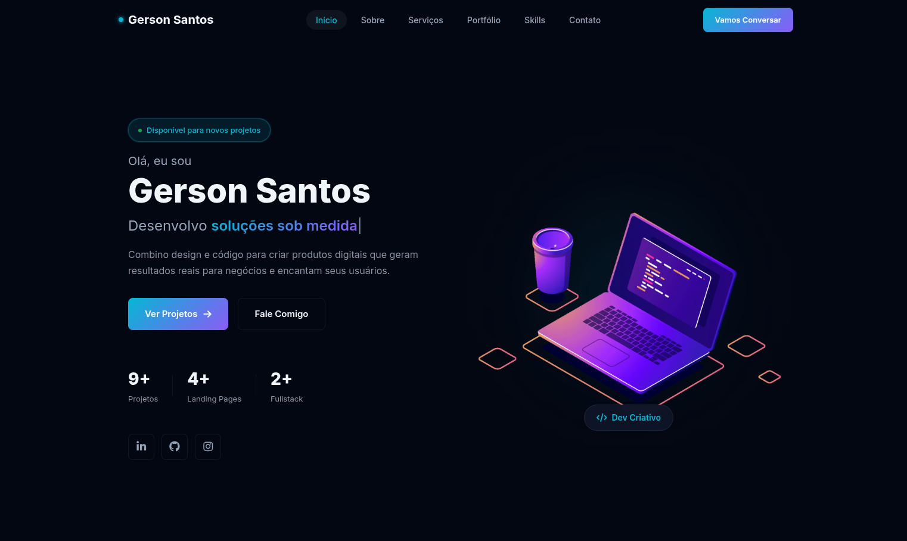

# 🚀 Portfólio Pessoal - Gerson Santos

<div align="center">
  
</div>

<h3 align="center">Landing page moderna e responsiva para portfólio pessoal de desenvolvedor web</h3>

<p align="center">
  <a href="#-sobre-o-projeto">Sobre o projeto</a> •
  <a href="#-funcionalidades">Funcionalidades</a> •
  <a href="#%EF%B8%8F-tecnologias">Tecnologias</a> •
  <a href="#-como-executar-o-projeto">Como executar</a> •
  <a href="#-licença">Licença</a>
</p>

---

## 📋 Sobre o projeto

Este é um portfólio pessoal desenvolvido como landing page para apresentar minhas habilidades, projetos e serviços como desenvolvedor web & freelancer. O projeto foi criado com foco em modernidade, performance e experiência do usuário, incorporando animações sutis, design responsivo e uma interface limpa e profissional.

O portfólio apresenta:
- **Seção Hero** com apresentação personalizada e redes sociais
- **Seção Sobre** com minha trajetória e paixão por tecnologia
- **Seção Portfólio** com filtros para visualização de projetos
- **Seção de Serviços** detalhando o que ofereço
- **Seção Skills** com minhas principais tecnologias
- **Seção de Contato** com formulário funcional

## ✨ Funcionalidades

- 🎨 **Design moderno e responsivo** - Adapta-se perfeitamente a qualquer tela
- ⚡ **Performance otimizada** - Carregamento rápido e animações fluidas
- 🌓 **Tema visual atraente** - Esquema de cores profissional com destaque para acentos
- 🎯 **Navegação intuitiva** - Menu fixo com tracking de seção ativa
- 📱 **Menu mobile** - Overlay deslizante para dispositivos móveis
- 📝 **Formulário de contato** - Com validação de campos e integração com Formspree
- 🎭 **Animações sutis** - Entrada de elementos com GSAP e ScrollTrigger
- 🔍 **Filtro de portfólio** - Categorização de projetos com MixItUp
- ✨ **Efeito de digitação** - Typed.js para apresentação dinâmica de habilidades
- ⚪ **Partículas de fundo** - Canvas com partículas interativas sutis
- 🔗 **Links para projetos** - Acesso direto aos repositórios e demonstrações

## 🛠 Tecnologias

As seguintes ferramentas foram utilizadas na construção do projeto:

<div align="center">
  
  
  
  
  
  
  
  
</div>

**Detalhes técnicas:**
- **HTML5** - Estrutura semântica e acessível
- **CSS3** - Variáveis CSS, Flexbox, Grid, animações e responsividade
- **JavaScript Vanilla** - DOM manipulation e lógica de interação
- **GSAP + ScrollTrigger** - Animações avançadas baseadas em scroll
- **MixItUp** - Sistema de filtragem e ordenação do portfólio
- **Typed.js** - Efeito de digitação para apresentação de skills
- **Font Awesome 6** - Ícones vetoriais e sociais
- **Google Fonts** - Fonte Inter para tipografia moderna
- **Formspree** - Backend para formulário de contato
- **Vercel** - Plataforma de deploy e hospedagem

## 📁 Estrutura do projeto

```
portifolio/
├── index.html              # Página principal
├── assets/
│   ├── css/
│   │   └── style.css       # Estilos personalizados
│   ├── js/
│   │   ├── gsap.min.js     # Biblioteca GSAP
│   │   └── main.js         # Lógica principal do site
│   └── images/             # Todas as imagens utilizadas
└── README.md               # Este arquivo
```

## ▶️ Como executar o projeto

1. **Clonar o repositório**
   ```bash
   git clone https://github.com/Gerson77/portifolio.git
   cd portifolio
   ```

2. **Abrir o projeto**
   Basta abrir o arquivo `index.html` em qualquer navegador moderno:
   ```bash
   # No Linux/Mac
   open index.html
   
   # No Windows
   start index.html
   ```

3. **Visualizar no navegador**
   O projeto será carregado diretamente, pois não há dependências de build ou servidor necessárias para execução básica.

> **Observação:** Para testar o formulário de contato localmente, você precisará configurar um endpoint do Formspree ou usar um serviço similar, já que o formulário faz requisição externa.

## 🎯 Funcionalidades em detalhes

### Header responsivo
- Menu fixo que aparece/desaparece com scroll
- Menu mobile com overlay deslizante
- Links ancorados para navegação entre seções
- Tracking de seção ativa baseado na posição de scroll

### Seção Hero
- Saudação personalizada com efeito de digitação
- Estatísticas dinâmicas (projetos, landing pages, fullstack)
- Links para redes sociais com efeito hover
- Botões de CTA destacados

### Sobre mim
- Layout em duas colunas (imagem + texto)
- Badge de experiência com estilo único
- Tags de habilidades com efeito hover
- Botão de contato direto

### Portfólio
- Filtros por categoria (Todos, Landing Pages, Fullstack)
- Cards de projetos com efeito hover e zoom
- Overlay informativo que aparece no hover
- Links diretos para repositórios e demonstrações
- Sistema de grid responsivo (3→2→1 colunas)

### Serviços
- Cards com ícones descritivos
- Destaque para o serviço mais procurado
- Lista de funcionalidades para cada serviço
- Layout responsivo que adapta o número de colunas

### Skills
- Grid de ícones tecnológicos
- Efeito hover com mudança de cor e elevação
- Ícones reconhecíveis de cada tecnologia
- Layout responsivo (4→2→1 colunas em telas menores)

### CTA (Call to Action)
- Banner destacado com gradiente animado
- Convite claro para iniciar um projeto
- Botão de CTA prominentemente posicionado

### Contato
- Informações de contato (email, localização, telefone)
- Ícones de redes sociais com links diretos
- Formulário com validação client-side
- Feedback visual de sucesso após envio
- Campos: Nome, E-mail, Telefone, Mensagem

### Footer
- Links rápidos para todas as seções
- Ícones de redes sociais
- Copyright atualizado automaticamente

## 🧪 Testes realizados

- Responsividade testada em dispositivos móveis (iPhone, Android) e tablets
- Compatibilidade verificada nos navegadores: Chrome, Firefox, Safari, Edge
- Performance auditada com Lighthouse (pontuações acima de 90 em performance, acessibilidade e boas práticas)
- Validação de formulário testada com diversos cenários
- Animações verificadas em diferentes dispositivos e conexões

## 📝 Licença

Este projeto está sob a licença MIT. Veja o arquivo [LICENSE](LICENSE) para mais detalhes.

## 👨‍💻 Autor

**Gerson Santos**

- LinkedIn: [https://www.linkedin.com/in/gerson-santos-silva/](https://www.linkedin.com/in/gerson-santos-silva/)
- GitHub: [https://github.com/Gerson77](https://github.com/Gerson77)
- Portfolio: [https://portifolio-puce-theta-49.vercel.app/](https://portifolio-puce-theta-49.vercel.app/)

## 🙏 Agradecimentos

- Inspiração em diversos portfólios de desenvolvedores na comunidade
- Bibliotecas open-source utilizadas (GSAP, MixItUp, Typed.js, etc.)
- Comunidade de desenvolvedores que compartilha conhecimento livremente
- Vercel pela hospedagem gratuita e facilidade de deploy

---

<div align="center">
  Feito com 💻 e ☕ por Gerson Santos
</div>

<p align="center">
  <a href="https://portifolio-puce-theta-49.vercel.app/" target="_blank">🔗 Visualizar o projeto ao vivo</a>
</p>